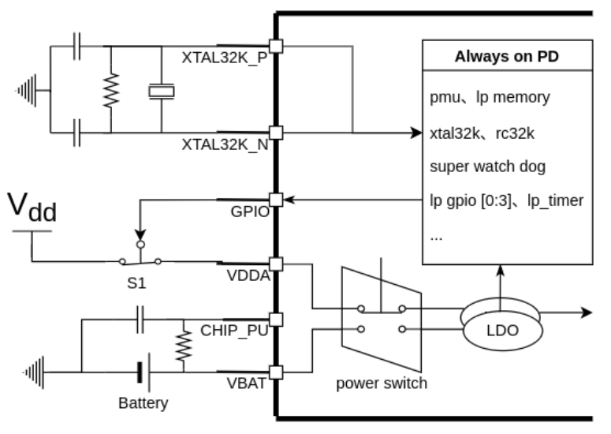

# P4RTC Internal Real-Time Clock Library (ESP32-P4 + Arduino)

An Arduino-compatible library for using the **ESP32-P4 internal RTC** with a simple epoch-based API.

The ESP32-P4 has an integrated RTC (Real-Time Clock) and supports an external backup battery through the VBAT pin, allowing the RTC domain to keep time when the main power supply is disconnected. **VBAT pin is 2.3V ~ 3.6V.**

This library reads and writes the ESP32-P4 system time using `time()` and `settimeofday()`, and can configure the ESP32-P4 PMU to keep the RTC domain powered from VBAT.

## Key Features

- Simple read/write using Unix Epoch (`time_t`)
- Designed for ESP32-P4 boards using the Arduino ESP32 core
- Optional VBAT backup configuration through the ESP32-P4 PMU
- Backup battery support through the ESP32-P4 VBAT pin

---

## VBAT Backup Circuit



The circuit above is based on Espressif's official ESP32-P4 battery backup documentation. Espressif documents that the ESP32-P4 integrates RTC functionality with VBAT backup support, that the PMU can switch the power source between VDDA and VBAT, and that the RTC TIMER continues counting after switching to VBAT when the main supply is removed.

Official reference: [ESP32-P4 Battery Backup Solution](https://docs.espressif.com/projects/esp-iot-solution/en/latest/low_power_solution/esp32p4_vbat.html)

---

## Basic Usage

```cpp
#include <Arduino.h>
#include <time.h>

#include <P4RTC.h>

#define USE_SAO_PAULO_TIMEZONE 1

P4RTC rtc;

void setup() {

    Serial.begin(115200);

#if USE_SAO_PAULO_TIMEZONE
    setenv("TZ", "BRT3", 1); // Sao Paulo: UTC-3
    tzset();
#endif

    // rtc.set_epoch(1784204274);

    rtc.enable_vbat_backup();
}

void loop() {

    time_t now = rtc.get_epoch();

#if USE_SAO_PAULO_TIMEZONE
    struct tm *tm = localtime(&now);
    const char *timezoneName = "Sao Paulo";
#else
    struct tm *tm = gmtime(&now);
    const char *timezoneName = "UTC";
#endif

    Serial.printf("%04d-%02d-%02d %02d:%02d:%02d %s (%lld)\n",
        tm->tm_year + 1900,
        tm->tm_mon + 1,
        tm->tm_mday,
        tm->tm_hour,
        tm->tm_min,
        tm->tm_sec,
        timezoneName,
        static_cast<long long>(now));

    delay(1000);
}
```

The full Arduino sketch is available in
[`package/examples/BasicUsage`](package/examples/BasicUsage/BasicUsage.ino).

---

## API

| Method | Description |
| --- | --- |
| `time_t get_epoch()` | Returns the current system RTC time as Unix Epoch. |
| `bool set_epoch(time_t epoch)` | Sets the system RTC time from Unix Epoch. |
| `bool enable_vbat_backup()` | Configures the ESP32-P4 PMU for automatic VBAT backup mode. |

---

## Installation

### Arduino IDE

This monorepo is not a single Arduino library. Use a release archive whose root
contains the contents of `P4RTC/package/`, then select **Sketch > Include
Library > Add .ZIP Library...**. The public sketch is available under **File >
Examples > P4RTC > BasicUsage**.

### PlatformIO

For a local checkout, point PlatformIO directly at the package directory and
adjust the relative path for your workspace:

```ini
lib_deps =
    symlink://../MyArduinoLibs/P4RTC/package
```

After registry publication, use the published P4RTC owner/name and version.

---

## Repository Layout

```text
P4RTC/
|-- package/
|   |-- src/
|   |-- examples/
|   |-- library.properties
|   |-- library.json
|   `-- keywords.txt
|-- development/
|   |-- src/
|   |-- boards/
|   |-- scripts/
|   |-- tools/
|   |-- platformio.ini
|   `-- DEVELOPMENT.md
|-- assets/
|   `-- circuit.png
`-- README.md
```

---

## Compatibility

This library is intended for **ESP32-P4** targets using the Arduino ESP32 core.

The implementation intentionally fails compilation on non-ESP32-P4 targets because it depends on ESP32-P4 PMU register definitions.

Build the maintainer project with `pio run` from `P4RTC/development/`. It
consumes the distributable package directly through `symlink://../package`.
